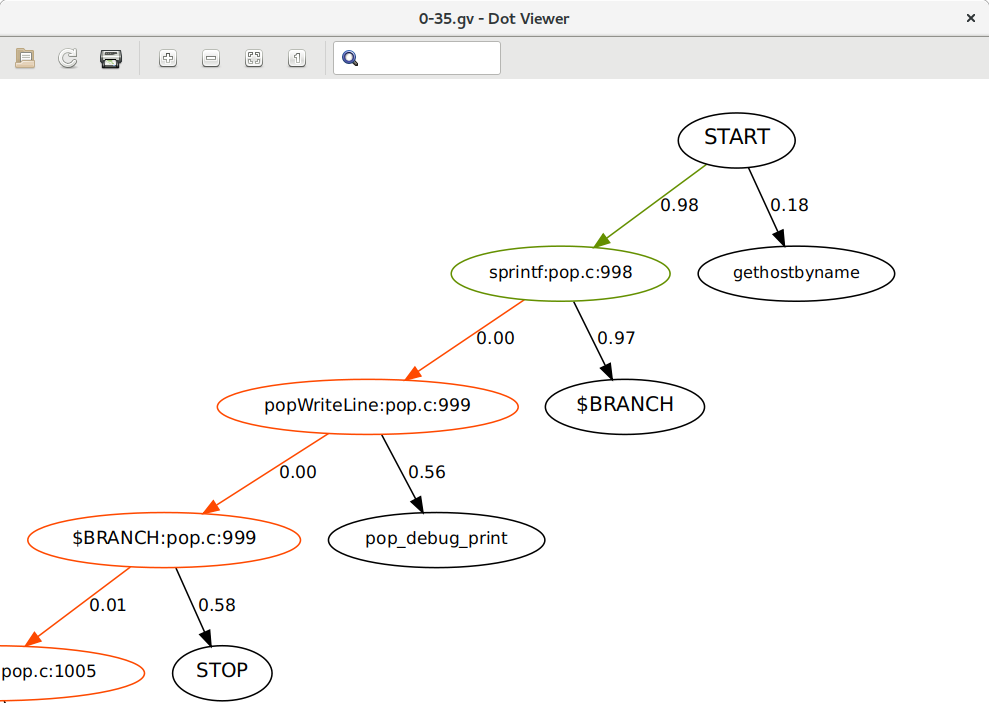

# Salento usage in 5 steps

1. `salento-repl.py pop.json` loads a dataset to memory.
2. **What are the most anomalous locations?** Command `group` gives you a
   bird's-eye of your dataset by showing you
   the score *per location* (line number in a single source file), which is
   divided *per package* (a package consists of multiple source files, and
   usually matches a directory).

    ```
    > group --pkg :3 --limit 1
    id: 0 pkg: ayttm-0.6.3/libproxy/ssl.c by: /home/tgc/ssl.c:152 anomalous: 57%
    id: 1 pkg: balsa-2.4.12/libbalsa/imap/pop3.c by: /home/tgc/pop3.c:610 anomalous: 80%
    id: 2 pkg: balsa-2.4.12/libbalsa/imap/siobuf.c by: /home/tgc/siobuf.c:339 anomalous: 65%
    ```

    **Notes:**

    Each entry shows the *unique package identifier* `id`, the package
    name `pkg`, the location name `by`, and the score `unlikely`; *100% means
    maximum anomaly*.

    Argument `--pkg :3` shows the first 3 packages in the given dataset.
    The syntax of the argument of `--pkg` follows [Python's slicing
    notation](https://stackoverflow.com/a/509295/2327050).

    Argument `--limit 1` shows the most anomalous location *per package*.

    You can always append `--help` for more information.

3. **Which sequence of calls end in a given anomalous location?**
   Command `seq` shows the score of each sequence in our dataset.

    ```
    > seq --pkg 1 --sub pop3.c:454 --limit 3
    id: 1119 count: 8 last: pop3.c:454 anomalous: 78%
    id: 1120 count: 9 last: pop3.c:454 anomalous: 73%
    id: 1120 count: 10 last: pop3.c:454 anomalous: 71%
    ```    

    **Notes:**

    Each entry shows the unique *sequence identifier* `id`, the number of
    calls in the sequence `count`, the last location `last`, and the
    anomaly score `anomaly` (where higher is more anomalous).

    Argument `--pkg 1` selects the package with identifier 1.

    Argument `--sub` selects all *sub-sequences* that end with a location
    `pop3.c:454`. Each sequence might have many sub-sequence,
    with varying anomaly scores.


4. **How do we visualize the sequence of calls?** We can generate visualization
    all sequences in a query by appending `--save` to our query, which
    generates Graphviz `*.gv` files:

    ```
    > seq --pkg 1 --sub pop3.c:454 --limit 3 --save
    ```

    If we run the following command in a **terminal** (in the same working directory):

    ```bash
    $ ls *.gv
    1-1119.gv  1-11202.gv  1-1120.gv
    ```

    **Note:**
    Argument `--save` iterates over each sequence and creates a Graphviz file.
    You can change the filename with `--save-fmt`.

5. Visualize Graphviz to identify an anomaly.

    ```
    $ xdot 1-1119.gv
    ```

    

    Colored edges represent the call sequence being rendered, these are
    annotated with the similarity between the given call and the most
    probable call.

    Black edges represent the most probable call and is annotated with
    the probability of that call.

    In this example, the tool is warning us about two anomalies:
      * *Missed checking the return value of an `sprintf` call.*
      * *After checking the return value of function `popWriteLine` the function should end.*
